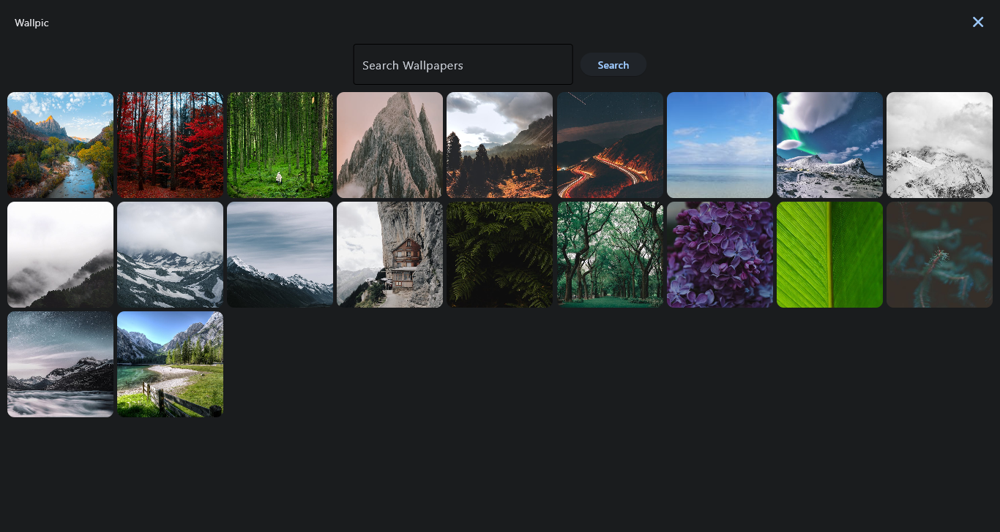
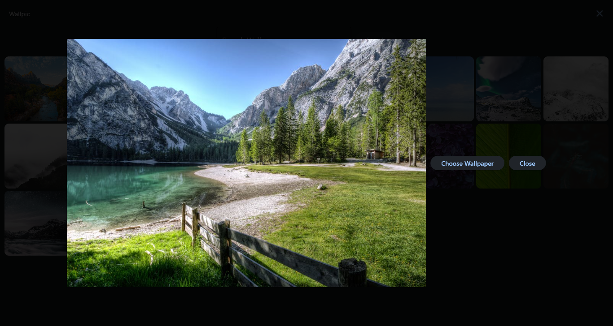

# Wallpic

Wallpic is a desktop application built with Flutter and Flet that allows you to search for and set wallpapers easily.

## Features

- Search for wallpapers based on keywords.
- Set wallpapers with just a click.
- Customize your wallpaper selection.

## Screenshots




## Installation

To install Wallpic, simply download the latest release for your platform from the [Releases](https://github.com/baqx/wallpic/releases) page.

## Usage

1. Launch the application.
2. Use the search bar to enter keywords for wallpapers you want to find.
3. Click on the wallpaper you want to set.
4. Optionally customize wallpaper settings.
5. Click "Set Wallpaper" to apply the selected wallpaper.

## Development

### Languages

- Python

### Libraries/Frameworks

- Flutter
- Flet

To run Wallpic locally for development:

1. Clone this repository:

```bash
git clone https://github.com/baqx/wallpic.git
cd wallpic
```

2. Replace PEXELS_API_KEY in main.py with your pexels api key.

To package this project for windows

1. Navigate to the project directory

2. Package for exe using this command

```bash
flet pack main.py --icon=assets/icon.png --product-version=1.1.0 --copyright=""
```

OR

```bash
flet build desktop
```
